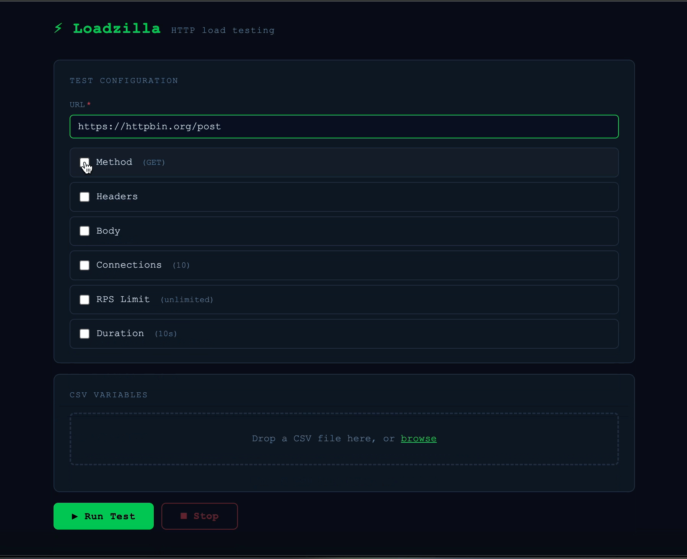
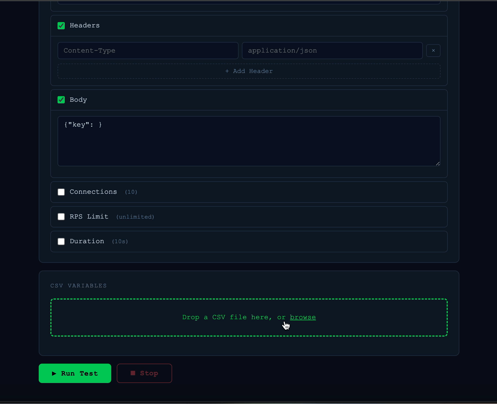

# ⚡ Loadzilla

Fast, zero-config HTTP load testing — run from the terminal or open the browser UI in one command.

---

## Install

```bash
go install github.com/lawi22/loadzilla@latest
```

Or download a pre-built binary from [Releases](https://github.com/lawi22/loadzilla/releases).

---

## Web UI

```bash
loadzilla serve          # opens on http://localhost:7777
loadzilla serve -p 9000  # custom port
```

Configure your test with checkboxes — only set what you need, everything else uses a sensible default.



Upload a CSV to parameterise any field. Column names become `{$COLUMN}` tokens you can click into the URL, headers, or body. Loadzilla cycles through rows round-robin across all workers.



Hit **Run Test** and watch results stream in live. The progress bar ticks every second; the full latency breakdown appears the moment the test finishes.


---

## CLI

The CLI is unchanged and needs no server running.

```bash
# Simple GET, all defaults (10 connections, 10s)
loadzilla -u https://httpbin.org/get

# 20 connections, 200 rps cap, 30 seconds
loadzilla -u https://api.example.com/users -c 20 -r 200 -d 30s

# POST with headers and body
loadzilla -u https://api.example.com/users \
  -m POST \
  -H "Authorization: Bearer $TOKEN" \
  -H "Content-Type: application/json" \
  -b '{"name":"alice","role":"admin"}' \
  -c 10 -r 50 -d 30s

# Read body from file
loadzilla -u https://api.example.com/import -m POST \
  -H "Content-Type: application/json" \
  --body-file ./payload.json \
  -c 20 -d 1m
```

### Flags

| Flag | Short | Default | Description |
|------|-------|---------|-------------|
| `--url` | `-u` | **required** | Target URL |
| `--method` | `-m` | `GET` | HTTP method |
| `--header` | `-H` | — | `Key: Value` header — repeatable |
| `--body` | `-b` | — | Request body as a raw string |
| `--body-file` | — | — | Read request body from a file |
| `--connections` | `-c` | `10` | Concurrent workers (goroutines) |
| `--rps` | `-r` | `0` | Max requests/sec — `0` = unlimited |
| `--duration` | `-d` | `10s` | Test duration (e.g. `30s`, `2m`) |

Press `Ctrl+C` at any time to stop early — a full summary still prints.

### CLI output

```
[████████████░░░░░░░░]  62% | 1,240 req | 97.8 rps | Errors: 3
```

```
Loadzilla Results
═════════════════════════════════════════════
 URL:          https://api.example.com/users
 Method:       POST
 Duration:     30s
 Connections:  20 | RPS Target: 200

 Requests
 ─────────────────────────────────────────────
 Total:        5,842
 Success:      5,839  (99.9%)
 Errors:       3  (0.1%)
 Throughput:   194.7 req/s

 Latency
 ─────────────────────────────────────────────
  Min:     12.4ms    P50:     38.2ms
  Avg:     41.1ms    P95:     76.4ms
  Max:    892.1ms    P99:    124.8ms
                     P999:   341.2ms

 Status Codes
 ─────────────────────────────────────────────
  200: 5,839
  500: 3
═════════════════════════════════════════════
```

---

## How it works

- **N goroutines** run concurrently, each sending requests in a tight loop
- A shared **token bucket** (`golang.org/x/time/rate`) enforces the RPS cap globally
- `net/http.Transport` is tuned with `MaxConnsPerHost` matching `--connections` — no silent pooling surprises
- Latency is recorded into a **mutex-protected HDR histogram** (µs precision) for accurate percentiles at any volume
- `Ctrl+C` (CLI) or closing the tab (web UI) cancels the context — in-flight requests drain cleanly before the summary prints

---

## License

MIT
